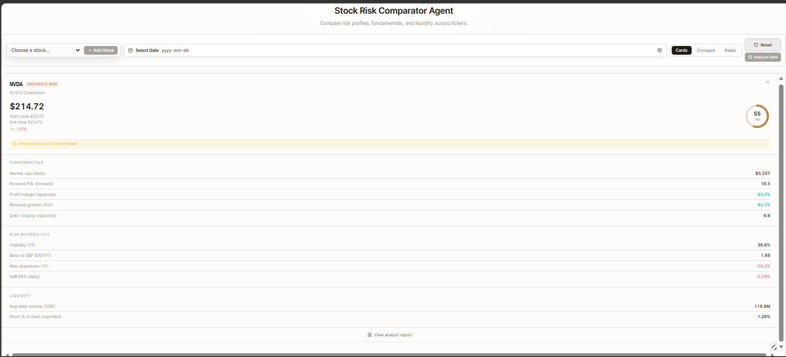
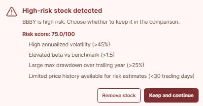
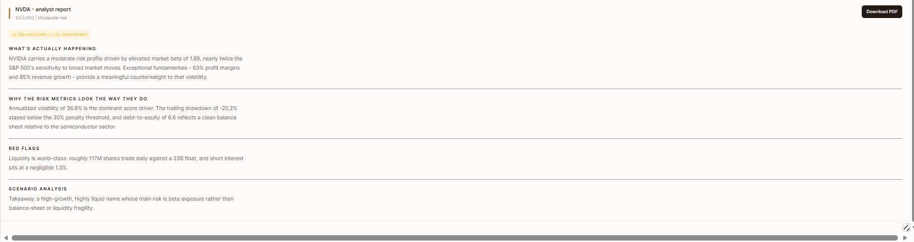
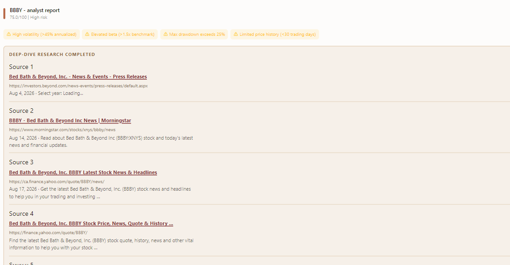
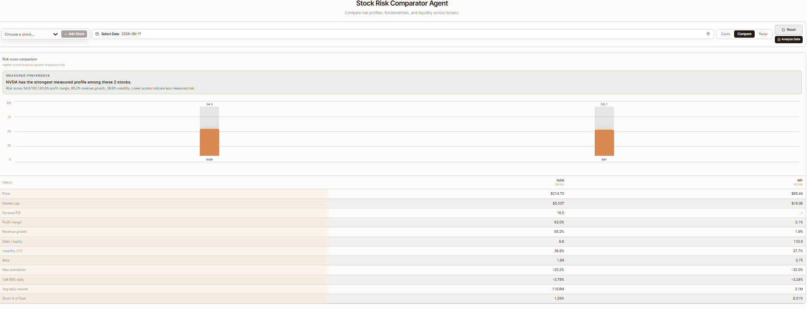
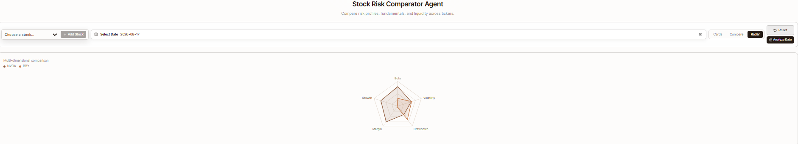
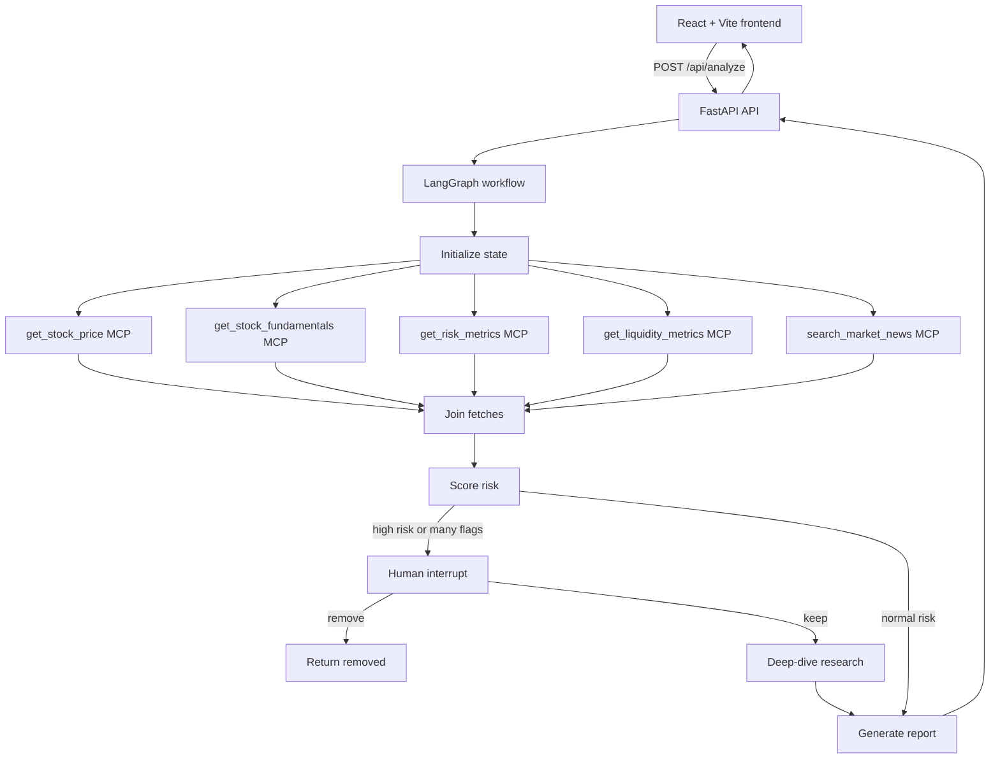

# Stock Risk Analysis Agent

A full-stack stock risk research application that combines quantitative market data, financial fundamentals, liquidity metrics, market-news search, and an LLM-generated report in one workflow.

The project is designed to answer a practical question: **before comparing or keeping a stock, what measurable risks, financial signals, liquidity concerns, and recent events should an investor review?** It is a research and comparison tool, not financial advice or an automated trading system.

## What The Project Does

For a selected ticker and analysis date, the application:

1. Retrieves price and fundamental data from Yahoo Finance through MCP tools.
2. Calculates volatility, beta, maximum drawdown, and historical VaR.
3. Retrieves liquidity and short-interest information.
4. Searches recent market news and filters results relevant to the company.
5. Calculates a transparent risk score from the measured signals.
6. Routes high-risk cases through a human review step.
7. Runs a deeper news search when the score or number of flags requires it.
8. Generates a five-section analyst report using the collected evidence.
9. Displays individual cards, a comparison table/chart, a radar chart, source URLs, and a downloadable PDF report.

The analysis date picker accepts dates from `2026-08-01` through today. The API applies the same rule so it cannot be bypassed by sending a direct request.

## Screenshots

### Dashboard



### BBBY Human Review

A high-risk result pauses the workflow and asks whether the stock should be removed or kept in the comparison.



### NVDA Analyst Report



### BBBY Deep-Dive Sources

Deep-dive results show the source title, full URL, date when available, and the returned snippet.



### Compare View



### Radar View



## Architecture



## LangGraph Orchestration

The orchestration is implemented in `graph.py` as a compiled LangGraph state graph. The graph carries a typed `RiskState` through each stage.

### 1. Initialize

The `init` node normalizes the ticker, stores the selected dates, and starts an empty error list. Each new analysis receives a fresh graph thread ID. The thread returned by the API is reused only when resolving the human review decision.

### 2. Fetch data in parallel

Five nodes start from `init`:

- `fetch_price`: closing price and date-range information.
- `fetch_fundamentals`: valuation, margins, growth, debt/equity, and market cap.
- `fetch_risk_metrics`: calculated volatility, beta, drawdown, and VaR.
- `fetch_liquidity`: volume, shares, float, and short interest.
- `fetch_news`: initial market-news search.

Each node calls an MCP tool through the shared `MultiServerMCPClient`. The `join_fetches` node provides a fan-in point before scoring begins.

### 3. Score risk transparently

The scoring node adds points for measurable conditions such as high annualized volatility, elevated beta, a large drawdown, high debt/equity, and elevated short interest. Missing or unusable core market data is treated as a risk condition rather than silently becoming a zero score.

The score is capped at `100`. Risk thresholds are:

- Below `35`: Low risk.
- `35` to below `60`: Moderate risk.
- `60` to below `80`: High risk.
- `80` and above: Severe risk.

### 4. Human-in-the-loop review

The graph calls LangGraph's `interrupt()` for BBBY, scores at or above the high-risk threshold, or cases with multiple risk flags. The API returns `status: "interrupted"` plus the ticker, score, flags, and a thread ID.

The frontend shows **Remove stock** and **Keep and continue**:

- `remove` resumes the graph and returns `status: "removed"`; the stock is not added.
- `keep` resumes the same graph thread and allows the remaining workflow to continue.

High-risk results are deliberately not cached, and each new analysis uses a fresh thread so an earlier Keep decision cannot bypass a later review.

### 5. Deep dive

When required, the graph searches several targeted queries covering recent coverage, bankruptcy/restructuring/delisting, financial distress, and ticker-specific risk. Results are filtered to the company and merged by URL so duplicate sources are removed.

The frontend displays cleaned source titles, clickable links, full URLs, dates, and snippets. The report prompt is instructed not to invent events or financial facts when evidence is limited.

### 6. Generate the report

The final node asks the configured chat model for five concise sections:

1. What's actually happening
2. Why the risk metrics look the way they do
3. Red flags
4. Scenario analysis
5. What to watch next

If the model connection fails, the backend returns a conservative fallback report instead of hiding the measured risk data.

## MCP Servers

The backend starts three local MCP servers as stdio subprocesses from `graph.py`:

- `stock_mcp.py`: Yahoo Finance price and fundamental data.
- `risk_mcp.py`: quantitative risk calculations using NumPy and Yahoo Finance history.
- `search_mcp.py`: market-news search using `ddgs`.

MCP keeps external data access in focused tools. LangGraph owns orchestration, routing, state, interruption, and report generation; the frontend only calls the FastAPI boundary.

## Project Structure

```text
api.py             FastAPI request validation and /api endpoints
graph.py           LangGraph state graph, scoring, review, research, and reports
stock_mcp.py       Price and fundamental MCP tools
risk_mcp.py        Risk and liquidity MCP tools
search_mcp.py      News-search MCP tool
prod_app.py        Serves the built frontend from FastAPI
src/App.jsx        React dashboard and interaction logic
src/style.css      Dashboard, report, review dialog, and chart styling
index.html         Vite entry HTML
package.json       Frontend scripts and dependencies
requirements.txt   Python dependencies
Dockerfile         Multi-stage frontend/backend container build
pic*.png           Project screenshots used in this README
```

## Requirements

- Python 3.11 or newer.
- Node.js 20 or newer.
- An OpenAI API key for report generation.
- Network access to Yahoo Finance, the news search provider, and the configured LLM provider.

## Configuration

Create a local `.env` file in the project root. It is ignored by Git and must never be committed:

```env
OPENAI_API_KEY=replace-with-your-local-key
RISK_AGENT_LLM_MODEL=gpt-4o-mini
```

Do not put API keys in Python files, React files, screenshots, README content, Dockerfiles, or shell history. `graph.py` loads `.env` locally with `python-dotenv`.

## Run Locally

### Backend

PowerShell:

```powershell
py -3.11 -m venv .venv
.\.venv\Scripts\Activate.ps1
python -m pip install -r requirements.txt
python -m uvicorn api:app --host 127.0.0.1 --port 8001
```

The backend health check is available at:

```text
http://127.0.0.1:8001/api/health
```

### Frontend

In a second terminal:

```powershell
npm install
npm run dev
```

Open:

```text
http://127.0.0.1:5174
```

The development frontend calls the backend at `http://127.0.0.1:8001`.

## Run With Docker

Build and run the production image:

```powershell
docker build -t stock-risk-analysis .
docker run --rm -p 8000:8000 --env-file .env stock-risk-analysis
```

Open `http://localhost:8000`. The production build rewrites the frontend API call to a relative path, so the browser and API are served from the same container origin.

## API

### Health check

```http
GET /api/health
```

### Analyze a ticker

```http
POST /api/analyze
Content-Type: application/json

{
  "ticker": "NVDA",
  "as_of_date": "2026-08-24",
  "thread_id": null,
  "decision": null
}
```

A normal completion returns `status: "completed"` and the collected analysis state. A high-risk case returns `status: "interrupted"` and a `thread_id`. Resolve it with the same ticker/date/thread ID and either `decision: "keep"` or `decision: "remove"`.

## Validation And Troubleshooting

- `npm run build` validates the Vite production bundle.
- `python -m py_compile api.py graph.py` checks backend syntax.
- A `400` date response means the selected date is before `2026-08-01`, after today, or not a valid calendar date.
- If the frontend says the analysis server is unavailable, confirm that port `8001` is running.
- If a report has limited research, treat that as limited evidence, not proof that no corporate event exists.
- Yahoo Finance data can be delayed, incomplete, unavailable for delisted symbols, or revised. The UI exposes unavailable values as `-` and flags missing core data.

## Confidentiality Audit

Before adding this README and screenshots, the repository was checked for common accidental credential exposure:

- `.env` is ignored by `.gitignore`.
- `.venv/`, `node_modules/`, `dist/`, Python caches, and `*.log` files are ignored.
- The tracked Git history contains no `.env`, private-key file, credential file, or common API-key/password pattern.
- `NVDA_risk_state.json` contains public market-analysis output and generated report text, not credentials.
- The six screenshots contain UI and public stock/research information; no API key, token, password, or private key is visible.

This is a repository-content audit, not a guarantee about credentials that may exist in local shell history, external services, or other untracked files. Before future pushes, run:

```powershell
git status --short
git grep -n -I -E 'sk-[A-Za-z0-9]{20,}|BEGIN (RSA|OPENSSH|EC) PRIVATE KEY|OPENAI_API_KEY[=:][^$\{[:space:]]+|password[=:][^$\{[:space:]]+' HEAD
```

If a real secret is ever committed, revoke it immediately, remove it from the current files, and rotate it with the provider. Removing a string from the latest commit alone does not remove it from Git history.

## Disclaimer

This project is for software demonstration, research organization, and comparative risk analysis. It does not provide personalized investment advice, a recommendation to buy or sell, or a guarantee about future performance. Verify important financial, legal, and listing information with authoritative sources.
